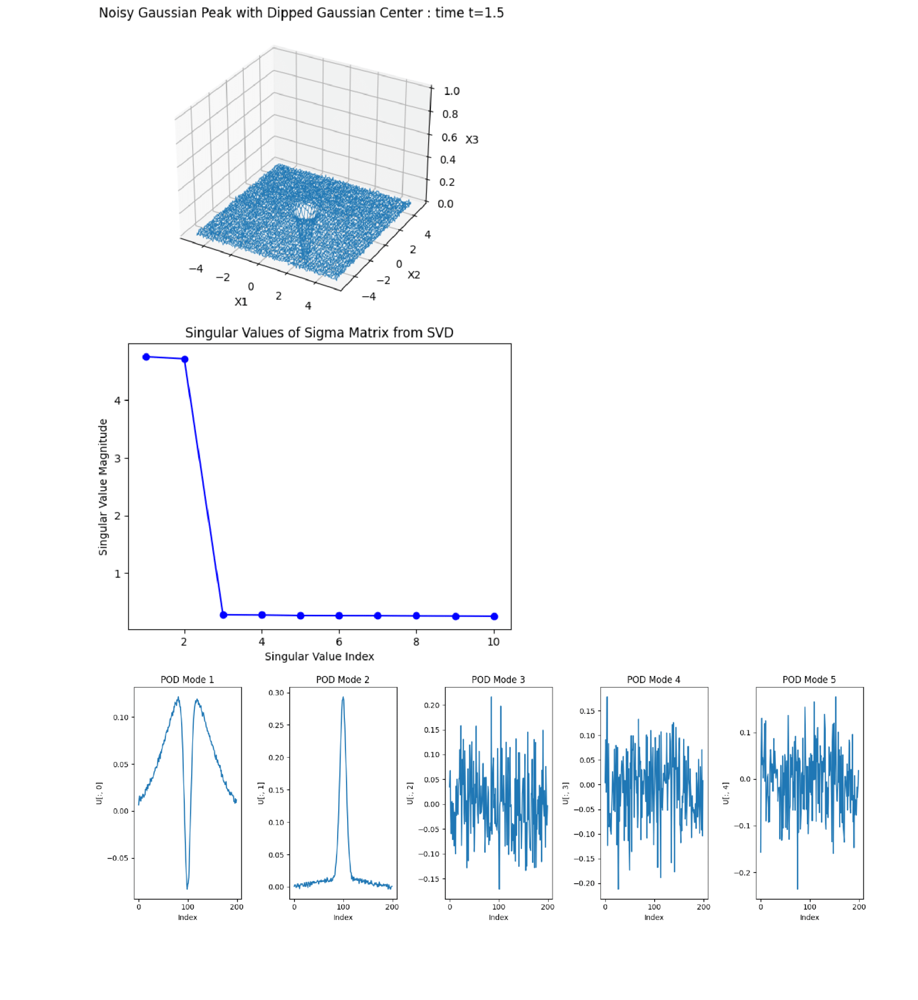

# Project Title: **Methods for Extracting Governing Equations and Dominant Patterns from Data** 

By **_Arindam Saikia_**
_Msc Physics Project_

Welcome! This project focuses on methods to extract governing equations and dominant patterns from data, applying techniques such as **Lasso Regression**, **Linear Regression** ,  **POD (Proper Orthogonal Decomposition)**, and **DMD (Dynamic Mode Decomposition)**.

---

## Table of Contents

1. [Introduction](#introduction)
2. [Project Objectives](#project-objectives)
3. [Methodology](#methodology)
4. [Results](#results)
5. [Contact Information](#contact-information)

---

## Introduction

This project aims to apply data-driven algortithms to various sets of data and obtain very close approximations to the underlying governing equations that generates the data. In addition, assistance in conditioning the data properly, for feeding into the algorithm as well as reducing the dimensionality, has been utilized by incorporating decomposition methods like POD and DMD.

---

## Project Objectives

- Employ **linear regression** techniques to approximate governing equations for **simple dynamical systems**, establishing a baseline for comparison with more advanced methods.
- Use **Lasso Regression** in order to promote **sparsity** in the predicted model.
- Apply **decomposition methods** ( POD and DMD ) to extract **dominant modes** from the data and analyze the terms involved for generating these dominant modes.
- Achieving **noise reduction** through the decomposition algorithms.
  
---

## Methodology

The methodology includes the following key steps:

1. **Data Preparation**: Preparing datasets and formatting them into matrices. Datasets used -Equation with Linear terms, Equation with Non-linear terms, Kuramoto Model Order Parameter and Gaussian + Sine profile with Noise data.
2. **Library Construction**: Constructing a library of basis functions for the regression model.
3. **Data Normalization** : Ensuring that all terms were on a comparable scale
4. **Regression & decomposition**: Performing the regression and decomposition algorithms on the given dataset.
5. **Coefficient Analysis and Visualization**: Visualizing the coefficients of the terms involved in the predicted model, extracted patterns from the modes etc.

---

## Results

- Problem 1 : **u = 11x + 5y** data

- Problem 2 : **u = 11xy + 5y^2** data

- Problem 3 : **Phase Coupled Kuramoto Model's Order Parameter**

- Problem 4 : **Amplitude-Variated Phase coupled Kuramoto Model’s Order Parameter**

- Problem 5 : **Gaussian + Sine profile with Noise data**

---
---
## Other Links

**Full Project Report** : [PDF](report.pdf)
Email: arindamsaikia16@gmail.com
